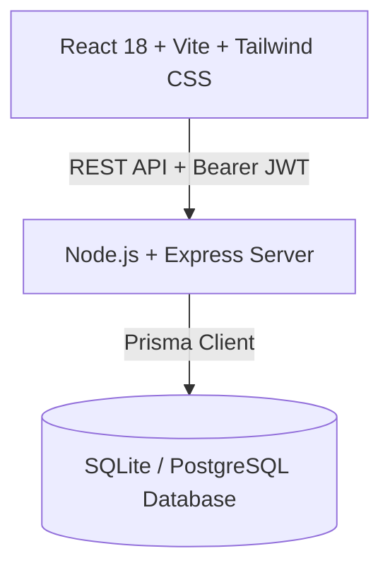

# Recroot — Next-Generation CV Management & Recruitment System

[](LICENSE)
[](https://reactjs.org/)
[](https://nodejs.org/)
[](https://www.prisma.io/)
[](https://tailwindcss.com/)

Developed by **M. R. Haque Jayeed**.

---

## 📌 Executive Overview

**Recroot** is an enterprise-grade recruitment platform designed around dynamic position alignment, reusable skill attributes, and live CV generation. Unlike legacy systems that store static document copies, **Recroot** dynamically renders candidate CVs as live views over a candidate's central master profile, filtered and formatted according to customizable position templates.

---

## 🔥 Key Killer Features

### 1. Reusable Attribute Library
- **Centralized Attributes**: Attributes are defined once by recruiters and shared globally across profiles, positions, and CVs.
- **8 Supported Data Types**:
  - `String` (Single-line text)
  - `Text` (Markdown-formatted text)
  - `Image` (Cloud storage URL)
  - `Numeric` (Numeric evaluation)
  - `Date` (Single date)
  - `Period` (Date range)
  - `Boolean` (Checkbox selection)
  - `Dropdown` (Custom option list)
- **AttributePicker Component**: Features prefix lookup, category filtering pills, and recent attribute suggestions.

### 2. Customizable Position Templates
- **Template Operations**: Create (blank or duplicate), edit, and delete positions with shared recruiter responsibility.
- **Dynamic Access Filters**: Access criteria evaluation (`=`, `!=`, `>`, `<`, `>=`, `<=`) against candidate attribute values to determine position eligibility.
- **Project Filtering**: Automated candidate project filtering based on technology tags and configurable `maxProjects` limit.
- **Real-Time Discussion Board**: Chronological position discussion posts (3-second polling) supporting Markdown. Recruiter views link directly to user public profile views.

### 3. Dynamic CV Generation & Live Profile View
- **Live Profile Binding**: CVs are dynamically assembled on-demand without redundant JSON data duplication.
- **Red Missing Value Highlight**: Missing or unfulfilled position template attributes are highlighted in **bright red border/background** (`empty-field-highlight`).
- **In-Place Attribute Editing**: Candidates can update attribute values directly on their rendered CV document, updating the candidate's master profile attribute value in real time.
- **Publish Lifecycle**: Track state (`DRAFT` vs `PUBLISHED`). Recruiters can view published CVs and toggle 1 recruiter like per CV.

### 4. Optimistic Locking Infrastructure
- All state-modifying endpoints (profile auto-saves every 5–10 seconds, custom attribute edits, position edits, CV attribute updates) send a version counter (`version`).
- The system validates matching versions before updating and increments `version`.
- Mismatches return `HTTP 409 Conflict` and present an interactive conflict resolution dialog.

### 5. Strict Table-Based UI Architecture
- **Zero In-Row Button Penalty**: Standardized table views for Positions, Attribute Library, CV lists, and User Management.
- **Appearing Table Toolbar**: Selection checkboxes trigger a sticky top action toolbar (`TableToolbar`) for contextual operations (View, Edit, Duplicate, Delete, Publish).

### 6. Internationalization & Themes
- **Visual Themes**: Light and Dark mode toggle with persistent state.
- **UI Languages**: Full English (`en`) and Bengali (`bn`) localization.

---

## 🛠️ Architecture & Tech Stack



| Layer | Technologies |
| :--- | :--- |
| **Frontend** | React 18, TypeScript, Vite, Tailwind CSS, Lucide Icons, React Markdown |
| **Backend** | Node.js, Express, TypeScript, Prisma ORM, JSON Web Tokens (JWT), bcryptjs |
| **Database** | PostgreSQL / SQLite schema via Prisma ORM |
| **Localization** | Custom English (`en`) & Bengali (`bn`) i18n Dictionary Engine |

---

## ⚙️ Installation & Running Locally

### Prerequisites
- Node.js (v18.0.0 or higher)
- npm (v9.0.0 or higher)

### 1. Backend Service Setup
```bash
# Navigate to backend directory
cd backend

# Install dependencies
npm install

# Push Prisma database schema
npx prisma db push

# Seed initial database records
npm run prisma:seed

# Start backend server
npm run dev
```
The Express backend server runs at `http://localhost:5000`.

### 2. Frontend Web Setup
```bash
# Navigate to frontend directory (in a new terminal)
cd frontend

# Install dependencies
npm install

# Start Vite development server
npm run dev
```
The frontend application will be available at `http://localhost:3000`.

---

## 🔐 Pre-configured Demo Accounts

| Role | Email | Password | Permissions |
| :--- | :--- | :--- | :--- |
| **Administrator** | `admin@recroot.com` | `password123` | Unrestricted full access, user account management, role assignment |
| **Recruiter** | `recruiter@recroot.com` | `password123` | Manage positions, duplicate templates, manage attribute library, like CVs |
| **Candidate** | `candidate@recroot.com` | `password123` | Manage master profile, fill attributes, manage projects, generate & publish CVs |

---

## 📄 License & Attribution

This project is licensed under the **MIT License** — see the [LICENSE](LICENSE) file for details.

Copyright (c) 2026 **M. R. Haque Jayeed**.
